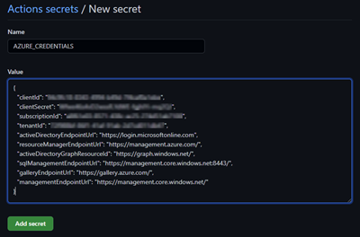
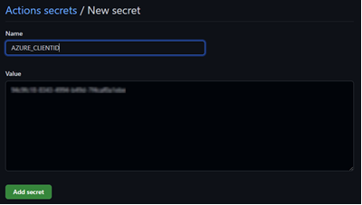
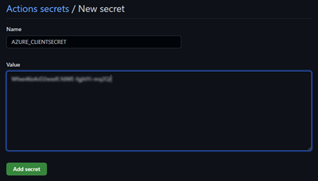
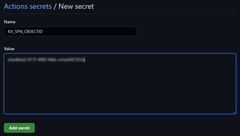
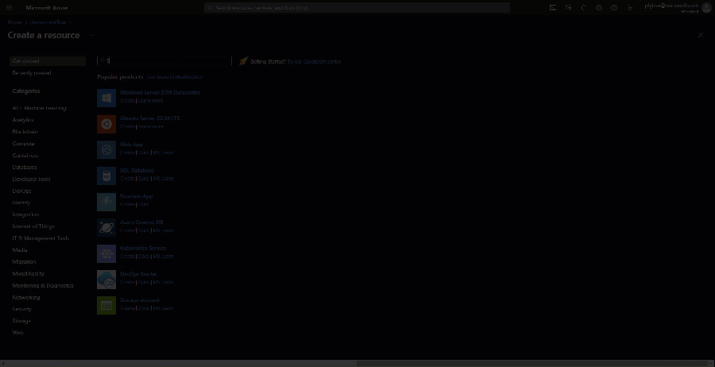
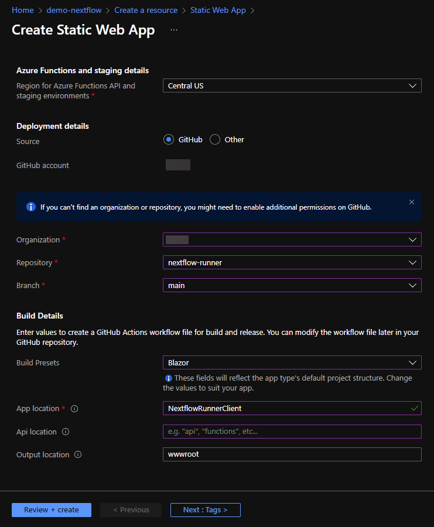

| Backend | Frontend |
| ------- | -------- |
| [](https://github.com/microsoft/nextflow-runner/actions/workflows/main.yml) | [](https://github.com/microsoft/nextflow-runner/actions/workflows/azure-static-web-apps-happy-ocean-0f6450210.yml) |

# Introduction
| :exclamation:  This is a starter-kit. There are several conditions that must be addressed before running in a production or enterprise scenario. Use this as a starting place and ensure you meet your organizations' security, performance, exception handling, monitoring and deployment concerns.  |
|-----------------------------------------|

Please submit a new issue to address any concerns you might find, or consider making a pull request.

## What?
A lightweight application designed to allow users to run Nextflow jobs without setting up Nextflow on Azure. It allows users to bring their own data, select from a list of preconfigured pipelines and execute a pipeline.

All output is stored in an Azure storage account and can be downloaded for further downstream processing.

## Why?
Nextflow is a commonly used workflow manager in the scientific community. By providing  a sandox type environment for users, users can quickly validate their data and generate data for further analysis without having to learn or configure nextflow jobs.

### Bio-informaticians
* Quickly get started with Nextflow on Azure.
* BYOD - Use preconfigured pipelines to experiment common pipelines with your data.
* All intermediate results are automatically tracked
* Output is available in Azure Storage for review
* Open-source community with available samples for most common pipelines.


### Operations teams
* Nothing to deploy
* Use Azure auto-scaling compute
* Use Azure Storage for maximum throughput and scalability and tighter access control using ACLs.
* Use Azure PaaS services to automate deployment and monitor progress.


# Getting started
See a preview of this application at [aka.ms/nextflow-runner](https://aka.ms/nextflow-runner).

## Nextflow Cloud Runner
Run a Nextflow pipeline in the cloud


## Requirements
This project has three parts, a database project, an Minimal API project, and a Blazor UI application. We've also included the necessary bicept templates to create and deploy the resources on Azure.

## Running locally
You can download and run the projects locally, .NET 6.0 is required.

## Running on Azure
Use the following steps to deploy in your own Azure subscription.
### Fork and Clone 
[Fork](https://github.com/Microsoft/nextflow-runner/fork) this Repo. Then, clone it to your local machine (or open in Codespaces!).


### Setup the prerequisites
1. Create a Resource Group in your Azure Subscription. You can accomplish this task using the Portal, Azure PowerShell, or the Azure CLI.
```
az login
az account set --subscriptionId <your-sub-id>
az group create --name <resource-group-name> --location <location i.e. "centralus">
```

2. Create an Azure AD service principal that has the `Owner` role assigned to the resource group created in the previous step. Pipe the output to a file, or save the results to a text file for later reference.
```
az ad sp create-for-rbac --name githubworkflow --role Owner --scope '/subscription/<your-sub-id>/resourceGroups/<resource-group-name>' --sdk-auth > my.azureauth
```
This command will save the output to `my.azureauth`. Open the file and use this information in step 4.

3. Find the ObjectId of the Service Principal created in the previous step. This can be located in the Azure Portal from the App Registrations tab on the Azure Active Directory blade. You can also use the CLI.
```
az ad sp show --id <clientId from my.azureauth file> --query objectId
```

4. Browse to your GitHub repo and switch to the `Settings` tab. From the `Security` section, choose `Secrets -> Actions`.
Create 4 new Repository Secrets with these properties:
<table>
    <thead>
        <tr>
            <th>Name</th>
            <th>Value</th>
            <th>&nbsp;</th>
        </tr>
    </thead>
    <tbody>
    <tr valign="top">
        <td>AZURE_CREDENTIALS</td>
        <td>entire contents of my.azureauth file</td>
        <td></td>
    </tr>
    <tr valign="top">
        <td>AZURE_CLIENTID</td>
        <td>clientId value from my.azureauth file</td>
        <td></td>
    </tr>
    <tr valign="top">
        <td>AZURE_CLIENTSECRET</td>
        <td>clientSecret value from my.azureauth file</td>
        <td></td>
    </tr>
    <tr>
        <td>KV_SPN_OBJECTID</td>
        <td>objectId value from step 3</td>
        <td></td>
    </tr>
    <tbody>
</table>

### Run GitHub Actions workflow to build and deploy backend API
1. Open the `.github/workflows/main.yml` file.
2. Update the env variables for Azure Subscription ID and Resource Group with your values.
``` yml
    AZURE_SUBSCRIPTION_ID: 'your azure subscription id'
    AZURE_RESOURCE_GROUP: 'name of resource group created in previous step (i.e. rg-nextflow-runner)'
```
3. Save your change. Commit and push to the main branch of your repo.
4. This will trigger the GitHub Action workflow to provision the Azure Resources and deploy the backend API code.

### Create an Azure Static Web App for the frontend
1. Open the `NextflowRunnerClient/wwwroot/appsettings.json` file.
2. Update the `NextflowRunnerAPI` property with the URL of the API you deployed in the previous section.
3. In the Azure Portal, browse to the Resource Group you created earlier.
4. Click Create and search for "Static Web App". Then click Create.



5. Provide a name and default Azure region. Then click "Sign in with GitHub".
6. Sign in with your GitHub credentials and authorize the application.
7. Once you return to the create screen. Choose your organization, repository, and branch. (This __must__ be your fork of the nextflow-runner repo)
8. Build Details should match the screenshot below:



| Property Name | Value |
| ------------- | ----- |
| Build Presets | Blazor |
| App location | NextflowRunnerClient |
| Api location | &lt;blank&gt; |
| Output location | wwwroot |

9. Click "Review + create" then "Create". Azure Static Web Apps will automatically create a CI/CD GitHub Actions workflow in your repository and deploy the application.
10. Use the generated URL from the Overview tab of your Static Web App to browse to the site.

<hr/>

## Contributing

This project welcomes contributions and suggestions.  Most contributions require you to agree to a
Contributor License Agreement (CLA) declaring that you have the right to, and actually do, grant us
the rights to use your contribution. For details, visit https://cla.opensource.microsoft.com.

When you submit a pull request, a CLA bot will automatically determine whether you need to provide
a CLA and decorate the PR appropriately (e.g., status check, comment). Simply follow the instructions
provided by the bot. You will only need to do this once across all repos using our CLA.

This project has adopted the [Microsoft Open Source Code of Conduct](https://opensource.microsoft.com/codeofconduct/).
For more information see the [Code of Conduct FAQ](https://opensource.microsoft.com/codeofconduct/faq/) or
contact [opencode@microsoft.com](mailto:opencode@microsoft.com) with any additional questions or comments.

## Trademarks

This project may contain trademarks or logos for projects, products, or services. Authorized use of Microsoft 
trademarks or logos is subject to and must follow 
[Microsoft's Trademark & Brand Guidelines](https://www.microsoft.com/en-us/legal/intellectualproperty/trademarks/usage/general).
Use of Microsoft trademarks or logos in modified versions of this project must not cause confusion or imply Microsoft sponsorship.
Any use of third-party trademarks or logos are subject to those third-party's policies.
